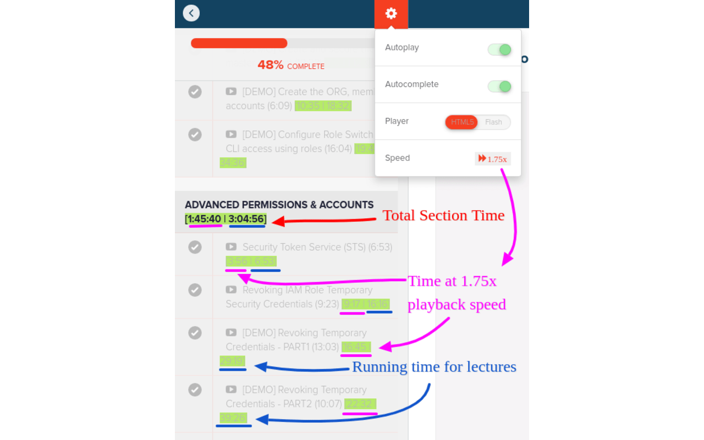

## Teachable Booster 🚀 

Find it here ➡️ [Google Chrome Webstore](https://chrome.google.com/webstore/detail/teachable-booster/daedpogehlchpldjgbnnloodlmanekec)
---
 
I've been interacting with Teachable for about a week and found a few missing elements. This plugin is my attempt to add this.
 
1. **View the time by your playback speed ⏪ ⏩**: You might watch lectures at your own playback speed. It's too much mental maths to estimate how much time a lecture/section would take at your own speed. Now it's right besides the section and lectures.
2. **View Section Time ⌛**: To plan better, you might want to know how much a particular section would take including all the lectures in that section. Now you can see the overall time for each section.
3. **View Running time for each lecture ⏰**: With this now you can see the cumulative total of all the lectures in a section up until that lecture.
 

 
### TODO:

- [ ] **Course Reset 🤯**: Although Teachable doesn't provide this, we can still handle it locally by using appropriate icons and storing the progress in the localstorage.
- [ ] **Time remaining for a Section ⌛**: It's good to see the remaining time for a section apart from the total time.This would be progress tracker but only for each section rather than course wide.

### Contributing:

Please feel free to raise a PR for anything you would like to add
